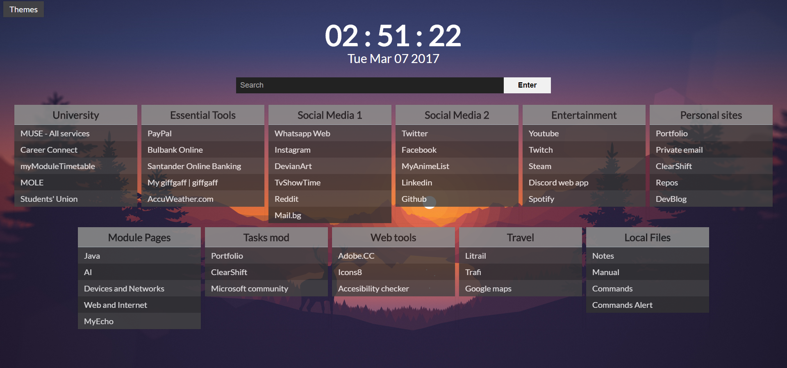
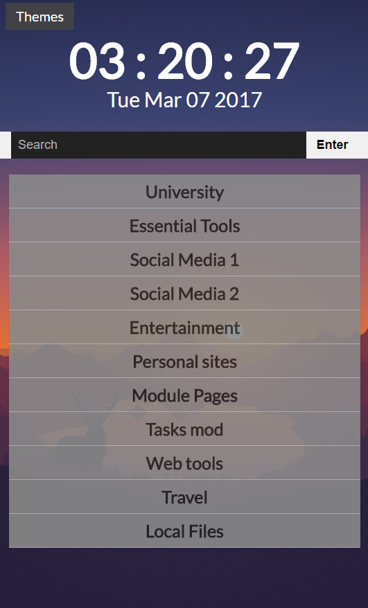

# StartPage

## What is StartPage?

A startpage is the page you first see when you open your browser or open a new tab (sometimes homepage).
This is a custom startpage template for links of favourite sites.

## Features

+ Themes

It has three responsive themes: Green, Gray & Modern
You can check them here: [**Demo**](https://mlvnt.github.io/StartPage/)
The default theme is Modern. It looks like this:

On mobile:

+ Integrated Search

By typing `command + "what you want to search"` in the search bar you can search directly in several sites.
If you want to view the list of available comands on the StartPage open the link `Commands` under `Local Files` Section or `?` in the search bar.
If you don't use any of this comands the query you type is going to be processed by the default search engine - Google.

| Command      | Corresponding Sites          |
| ------------- |:-------------:|
| ?      | HELP |
| a:      | AMAZON |
| d:      | GOOGLE DRIVE |
| G:       | FACEBOOK |
| g:       | GITHUB |
| i:       | INSTAGRAM |
| m:       | MYANIMELIST |
| r:      | REDDIT |
| t:      | TWITTER |
| tw:    | TWITCH  |
| w:      | WIKIPEDIA  |  
| y:      | YOUTUBE  |  

+ Link Local Files

## How to install?

Go to your browser's homepage settings and replace the current homepage with the
directory on your local machine in which your StartPage is stored. 

OR

Install the Chrome extention New Tab Redirect to replace the new tab with StartPage.

## Future Iterations

Planned to be include or tweaked:

1. Notes
2. Icons
3. Weather
4. Cleaner Code
5. More Themes
6. Minified CSS, HTML & JS
7. Calendar
8. Thor sites list
9. Favicon
10. Bug Report section
11. Manual & Commands Button
12. Footer
13. Add SCSS
14. Database

## Projects Used

1. [Frontpage by Jasius](https://github.com/Jasius/Frontpage) 
2. [primetoxinz.github.io by primetoxinz](https://github.com/primetoxinz/primetoxinz.github.io) 
3. [Tilde by cadejscroggins](https://github.com/cadejscroggins/tilde) 

## License

The code is licensed under the MIT License.